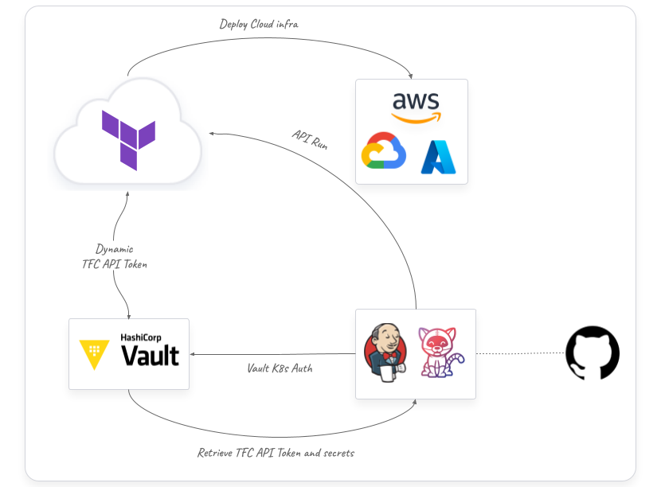
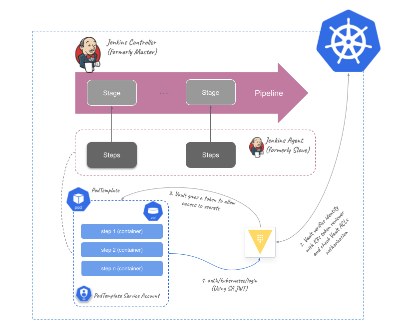

# CI/CD Pipelines Vault Integration

This repo shows different examples of securing CI/CD pipelines with [HashiCorp Vault](https://www.vaultproject.io/), using Jenkins in Kubernetes or [Tekton](https://tekton.dev/) as CI/CD engines.

To demonstrate how sensitive data is stored and secured in Vault we are using a very simple pipeline example that calls a [Terraform Cloud](https://app.terraform.io/app/organizations) workspace to deploy infrastructure. Here is a high level architecture workflow of the integration:



In this simple example Vault creates a short-live Terraform Cloud token that is used to provision a specific infrastructure from the Terraform Cloud workspace. This token is used in an API call from the pipeline. At the same time, some of the variables values that are used in the Terraform execution are stored in Vault, and injected into the pipeline to update the Terraform Cloud specific variable before executing the Terraform run.

## Pipeline secrets injection from Vault

HashiCorp Vault uses identity to authenticate and authorize access to the encrypted data or secrets. This identity is commonly authenticated using 
an external identity provider, like a Cloud IAM or Kubernetes identities (service accounts) as an example. In a CI/CD pipeline it works like:

* The pipeline executor uses a specific identity to authenticate into Vault
* Vault validates identity from an external provider (or could be also Vault depending on the authentication method)
* Vault gives then a token to the pipeline executor with a TTL (time-to-lice) to allow access to secrets, which are controlled by ACL policies defined in Vault
* Once the secrets are retrieved, the sensitive data needs to be managed by the pipeline executor or orchestrator (mask data in the pipeline logs, for example)

To deal with Vault authentication from the app or pipeline executor, the [Vault Agent](https://developer.hashicorp.com/vault/docs/agent?optInFrom=vault-io) can be a good approach to manage token renewals and secrets template retrieval, but not required.

### The Jenkins use case 

Jenkins has a *Controller-Agent* (formerly known as *Master-Slave*) approach. Which means that there is a `Controller` that orchestrates the pipeline workflow, and many  `Agents` connected as different nodes that execute all the steps orchestrated in the pipeline. The pipeline concept is about `Stages`, which each of them run several `Steps` in the nodes (`Agents`). All the orchestration execution occurs in the `Controller`, and the tasks execution in the `Agent`.

Also, there is a wide [Jenkins plugin ecosystem](https://plugins.jenkins.io/) that facilitates integration with all external tools needed during the orchestration or execution of the pipelines. One of the well known core plugins to manage secrets statically in Jenkins pipelines is the [credentials](https://plugins.jenkins.io/credentials/) and the [credentials binding](https://plugins.jenkins.io/credentials-binding/).

A common issue on using these plugins as secrets management is that it doesn't scale, mainly because of a secrets sprawl challenge and a non-identity approach (it relies on Jenkins RBAC authentication). But from the other hand these plugins are a good way to mask sensitive data in the Jenkins pipeline execution, to avoid secrets retrieval in the pipeline logs. Here is where HashiCorp Vault comes into picture:

* Vault centralizes secrets management based on identity. All Jenkins Agents use the same external Vault, authorizing access based on their identities
* Jenkins credential plugins manage Jenkins identity (like tokens, Kubernetes secrets AppRole IDs, etc.) and the pipeline execution, taking care of the secrets masking once they are already retrieved to the `Agents` 
* Vault can manage dynamic secrets, so pipelines can retrieve secrets that are only valid for a short period. So even though that you could be smart enough to hack the secret from Jenkins pipeline, that credential is not valid anymore
* Jenkins also manages the "ephemerality" of the Agents, so if you run a Jenkins ephemeral `Agent`, the retrieved secrets from Vault are only there during the pipeline execution. This is the default behaviour in Kubernetes deployment, for example.

### Jenkins on Kubernetes to understand Vault injection

To understand how Jenkins integrates with Vault, here is a Kubernetes Jenkins deployment use case, using [Vault Kubernetes Auth method](https://developer.hashicorp.com/vault/docs/auth/kubernetes) to authenticate based on the Kubernetes service accounts identity:



> *NOTE: We are not putting the Vault Agent K8s injector in this diagram on purpose*


The [Vault Agent injector for K8s](https://developer.hashicorp.com/vault/tutorials/kubernetes/kubernetes-sidecar) could be used for the [Jenkins PodTemplates](https://www.jenkins.io/doc/pipeline/steps/kubernetes/) to retrieve secrets into the Agent Pods. But in this case any pipeline step could get (or show in the pipeline log) the Vault token and the secrets stored in the Pod shared volume (a volume mounted for all containers in the Agent Pod).

Instead of that, we are proposing different - but similar - approaches, that are configured in the [Jenkinsfile examples of this repo](jenkins/) directory of this repository:

* By using the [Jenkins Vault plugin](https://plugins.jenkins.io/hashicorp-vault-plugin/), Jenkins agent can authenticate into Vault using the [Kubernetes Credential](https://plugins.jenkins.io/hashicorp-vault-plugin/#plugin-content-vault-kubernetes-credential) managed in the Jenkins `Controller`. Then, the plugin can retrieve and bind secrets into pipeline environment variables that can be used during pipeline steps. This variables are masked in the pipeline by the Vault plugin. In this case we protect the Vault token and the secrets retrieved in masked variables. This can be an approach to inject static secrets ([pipeline example](jenkins/Jenkinsfile.vault-tf-vars)).
* Using a credentials binding plugin in Jenkins to bind `VAULT_TOKEN`, `VAULT_ADDR` and `VAULT_NAMESPACE`. These are sensitive environment variables in the pipeline that can be used in a Vault API call to retrieve secrets. But the retrieved secrets are not masked and we need to deal with secrets persistence during pipeline execution. This can be an use case for short-live dynamic secrets from Vault, because even though that you can retrieve the secret in the pipeline log, this is only valid for a short time ([pipeline example](jenkins/Jenkinsfile.vault-tf-vars-binding))..
* Not using any plugin at all. In this case, because the Jenkins `Agent` is just an ephemeral Pod running in the Kubernetes cluster, we use the service account token that is in `/var/run/secrets/kubernetes.io/serviceaccount/token` to authenticate into Vault using the API endpoint `/v1/auth/kubernetes/login`. Then, we store the Vault token retrieved to be used on Vault API requests. In this case, either Vault tokens and secrets can be shown in the pipeline log. The use case here would be for very short pipelines. By using short-live Vault authentication tokens in every step (in a different container, for example) also with Vault dynamic secrets, it wouldn't be problematic showing the credentials during pipeline execution. Also, bear in mind that everything dies after pipeline finish (so Vault TTLs should be shorter than average pipeline execution time, if known previously). [Here is an example](jenkins/Jenkinsfile.vaultnoplugin)


# Deploy your demo environment

In this repository you can deploy and test pipelines with the previous approach, based on a Jenkins Kubernetes deployment. Also, there is included a Tekton example to run similar pipeline use case.

## Requirements

* Running K8s cluster
* `kubectl` CLI installed
* Helm CLI installed
* A Terraform Cloud user and organization (some of the example pipelines do a TFC run)


## Installation

Install Vault and Jenkins:
```bahs
cd install
make jenkins
```

The script is going to ask if you are using the righ K8s context. Press any key to continue or Crtl'C to cancel.

> NOTE:
> *If you want to install every included CI/CD engine (Tekton Pipelines by now):*
> ```bash
> make install
> ```

Change the values of the static secrets to be used in Vault in the file `install/config/secrets.json`:
```json
{
  "<tfc_var1>": "<value_to_be_set>",
  "<tfc_var2>": "<value_to_be_set>",
  "..." : "...",
  "<tfc_varn>": "<value_to_be_set>",
  "tfe_org": "<your_tfc_org>",
  "tfe_token": "<static_example_tfe_token>",
  "gh_user": "<gh_token>",
  "gh_token": "<gh_token> "
}
```

Also, configure the values of another secret with only the Terraform Cloud variables of your workspace. That is in the file `install/config/tfe_values.json`:

```json
{
  "<tfc_var1>": "<value_to_be_set>",
  "<tfc_var2>": "<value_to_be_set>",
  "..." : "...",
  "<tfc_varn>": "<value_to_be_set>"
}
```

`<tfc_var1> ... <tfc_varn>` are **existing variable keys in your Terraform Cloud Workspace**. It they are not existing in the Workspace pipelines will fail.


Configure Vault with the required secrets and Kubernetes auth:

```bash
make configure TFEORG=<your_TFC_organization> TFEUSER=<your_TFC_user>
```

## Jenkins pipelines integration

This repo has some Jenkins pipelines examples with Vault integration in the `jenkins` folder. Jenkins deployment with JCasC of this repo configures already a multibranch pipeline using the pipeline as code in `jenkins/Jenkinsfile.valt-tf-vars`.

> NOTE: First build failure
> The first automatic build of the pipelines may fail because of the non-existing previous parameters in Jenkins configuration. Then you need to do a new build of the multi-branch pipelines to successfuly run them with your parameters values.

Jenkins is installed in the `jenkins` namespace:

```bash
kubectl get all -n jenkins
```

The password for the `admin` account is in `jenkins-admin` K8s secret:

```bash
kubectl get secret -n jenkins jenkins-admin -o go-template='{{ index .data "jenkins-admin-password" }}' | base64 -d
```

If you can't expose a `LoadBalancer` service, do a `port-forward` of your Jenkins service in a different terminal:
```bash
kubectl port-forward svc/jenkins -n jenkins 9090:8080 --address 0.0.0.0
```

Then you should be able to access Jenkins at [http://localhost:9090](http://localhost:9090)

You should have a pipeline already configure in [http://localhost:9090/job/HashiCorp/job/vault-tfe-pipeline/](http://localhost:9090/job/HashiCorp/job/vault-tfe-pipeline/)

## Tekton pipelines example

This repo has also a [Tekton pipelines](https://tekton.dev/) example using HashiCorp Vault integration. Use [this other repo](https://github.com/dcanadillas/tekton-vault) for a complete explained example of the integration with Tekton and Vault.


You can install Tekton in your K8s cluster from this repo (from the `install` folder):

```bash
make tekton
```

Then you can deploy the Tekton pipelines by applying them in your `default` namespace (you can do in other namespaces, but then you need to change the Kubernetes Auth role in Vault to give permissions to that namespace):

```bash
kubectl apply -f ./tekton -n default
```